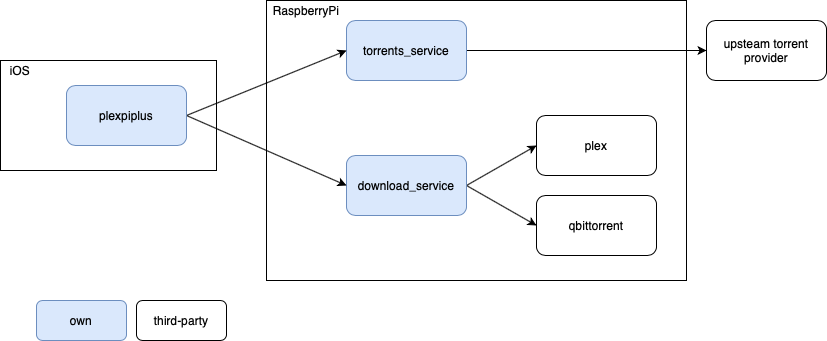

# plexpi

This organization contains the repositories for a RaspberrryPi based home media server that support downloading torrents via a REST API and an iOS application.

## download_service

[Source](https://github.com/plexpi/download_service)

A REST API that supportes downloading torrents. It uses `qbittorrnet` as a torrent client to actually download the torrent. Once a torrent is added it updated Plex library to pick up the changes.

## torrent_service

*Currently private*

A service that exposes a REST API for searching sereies and movies. Uses an other torrent service as an upstream.

## plexpiplus

*Currently private*

The repository of the iOS app.
